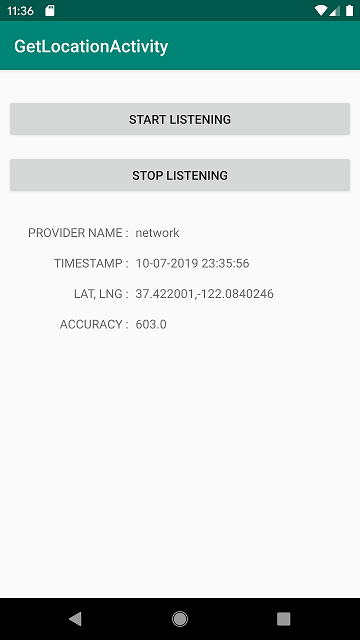

# Android_Get_Location_example
Simple example of location base android apps. In this part I will receive an updated current location information and display on simple textview also automaticly update when location changed.

The core of this part is the usage of LocationListener Class. I'll use onLocationChanged method to send location data to our main activity and display on the screen. 

First of all, I'll ask user to allow location access. This app wil use just NETWORK_PROVIDER.

Informations on the screen will update as location have change.

Don't forget to stop listener when you finish. Because listener will run in background if you don't fully close your app.

Here is my tutorial blog for this.

https://medium.com/@eros.esteem/simple-location-tracking-on-android-a9afbcad5875

I hope this concept will be useful for your next location base application.  

